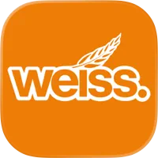
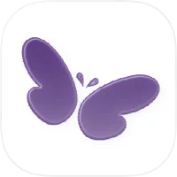
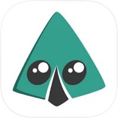
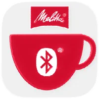
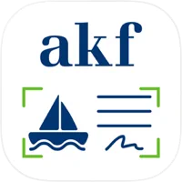
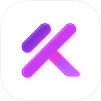
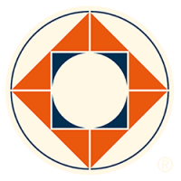

<!-- _class: lead -->

Eine maßgeschneiderte Stadt-App für Haltern am See

---

## Über Uns

Dominic Drees

App Developer

Heise Medien GmbH & Co KG

dominic.drees@foraum.de +49 151 651 43990

Julius Maetzig

Backend Developer

OptiSense GmbH & Co KG

juliusmaetzig@gmx.de +49 152 573 38483

Jan Rockahr

Management & Design

RedUhu

jan.rockahr@red-uhu.de +49 157 804 45408

---

## Erfahrung, die zählt

  

    
200+

    
Veröffentlichte Apps

  

  

    
10+

    
Jahre Erfahrung

  

  

    
iOS & Android

    
Native & React Native

  

  

    
Städte

    
& Unternehmen

  

  

Bochum App

  

Copago Apps*

  

Aareon Apps*

  

PNS 24 Jolifin

  

SKS

  

Staffice

  

Foraum

  

Melitta

  

Afk Bank Apps*

  

KorekushonX

  

Borchers Borken

  

Und viele mehr

---

## Was macht uns besonders

<h3>100 % Lokal</h3>

Wir leben hier. Wir kennen Haltern, seine Eigenheiten und seine Menschen - keine fremde Agentur.

<h3>Maßgeschneidert</h3>

Keine Stempellösung. Gebaut speziell für Haltern - nicht für die 50. Stadt kopiert.

<h3>Bewährte Erfahrung</h3>

200+ veröffentlichte Apps im Bereich B2B und B2C. Jede Herausforderung schon gelöst.

<h3>Klein & Agil</h3>

Direkte Linie zu den Entwicklern. Keine Tickets, kein Account Manager - Wünsche werden schneller umgesetzt.

<h3>Kostentransparenz</h3>

Keine versteckten Modulkosten, keine ewigen Monatsgebühren. Die Stadt behält die Kontrolle.

<h3>Alles aus einer Hand</h3>

App, Backend, Hosting, Design und Medien - komplett bei uns, ohne Drittanbieter.

---

## Was die App können soll

<h3>Lokale News</h3>

Stadtmeldungen und Push-Alerts für wichtige Informationen.

<h3>Interaktive Karte</h3>

Navigation, Gastronomie, Sehenswürdigkeiten und lokale Betriebe.

<h3>Veranstaltungen</h3>

Events & Termine, mit Push-Erinnerungen und Kalender-Export.

<h3>Stadtverwaltung</h3>

Formulare, Öffnungszeiten und Behördengänge - digital und einfach.

<h3>Mängelmelder</h3>

Bürger melden Schäden direkt: Straßen, Reinigung, Verkehrssicherheit.

<h3>Müllkalender</h3>

Abfuhrtage im Blick, mit rechtzeitiger Erinnerung.

<h3>Bürgerbeteiligung</h3>

Direkte Partizipation: Abstimmungen, Rückmeldungen und Vorschläge.

<h3>Und vieles mehr</h3>

Wir sind offen für weitere Anforderungen.

---

## Technik & Infrastruktur

<h3>App</h3>

<ul>
<li>React Native (iOS & Android)</li>
<li>Native Performance & Look</li>
<li>Offline-fähig</li>
<li>Push-Benachrichtigungen</li>
<li>CI Deployment</li>
<li>...</li>
</ul>

<h3>Backend</h3>

<ul>
<li>API, skalierbar & sicher</li>
<li>Datenbank & Redis Cache</li>
<li>DSGVO-konform</li>
<li>Automatische Datensicherung</li>
<li>...</li>
</ul>

<h3>Hosting*</h3>

<ul>
<li>Lokale Server in Haltern</li>
<li>Volle Datenkontrolle der Stadt</li>
<li>Kein Cloud-Drittanbieter</li>
<li>Lokale Betreuung</li>
<li>...</li>
</ul>

---

## Maßlösung statt Stempel

<h3>Standard-App von der Stange</h3>
<ul>
<li>Einmalige Einrichtung: 15.000 € pro Stadt</li>
<li>Laufende Kosten: 800 €+ / Monat</li>
<li>Jedes Extra-Modul: 2.000-3.000 € mehr</li>
<li>Anpassungen nur soweit der Anbieter es erlaubt</li>
<li>Kein lokaler Kontakt, kein Verständnis vor Ort</li>
</ul>

<h3>Unsere Lösung</h3>
<ul>
<li>Faire, transparente Entwicklungskosten</li>
<li>Geringe laufende Kosten nur für Hosting und Hardware</li>
<li>Alle Features inklusive, keine Modulpreise</li>
<li>Vollständig auf Haltern zugeschnitten</li>
<li>Direkt erreichbar als lokale Partner</li>
</ul>

<strong>Beispiel Waltrop:</strong> Die Stadt stieg von ihrer Standard-App ab, als sie die Website neu startete. Das Produkt ließ sich nicht anpassen. Eine Maßlösung wächst mit der Stadt.

---

## So könnte es laufen

Kickoff

Anforderungen aufnehmen, Ziele der App gemeinsam festlegen.

Konzept & Roadmap

Funktionen, Zeitplan und transparente Kostenaufstellung.

Prototyp-Sprint

Erste Demo in 2-3 Wochen, testbar auf dem Gerät.

Feedback-Runden

Iterativ verfeinern, jederzeit anpassbar.

Launch & Support

Livegang, wir bleiben als lokaler Partner dabei.

---

<!-- _class: closing -->

  
Vielen Dank.

  
Wir freuen uns auf das Gespräch.

  

    

      
Dominic D.

      
dominic.drees@foraum.de +49 151 651 43990

    

  

